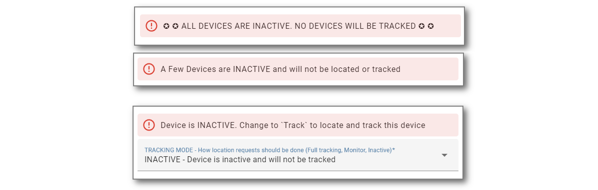

# Migrating iCloud3 from v2.4.x to v3.0

iCloud3 v3 is a true Home Assistant Integration that is configured on the **HA Settings > Devices & Services > Integration > iCloud3** screen. That means the yaml parameters in the *configuration.yaml* and *config_ic3.yaml* files are no longer used or needed. 

When iCloud3 is added to HA on Integrations screen, the parameters in these files are migrated to the new internal files (*config/.storage/icloud3/configuration*). The migration should be painless but it is required that that they be reviewed before they will be used. This is done on the configuration screens using *The Configuration Wizard* described in general in the *iCloud3 Components* chapter and in detail in the *Configuration Parameters* chapter.

!> IMPORTANT - YOU MUST REVIEW THE MIGRATION RESULTS ON THE CONFIGURATION SCREENS - The 'old yaml' parameters will be migrated again and again until they are reviewed with *The Configuration Wizard*. Once the review is done, the migrated parameters (and any changes that were made) will be used. The 'old yaml' parameters can then be deleted.

Generally, you will do the following:
1. Install iCloud3 from HACS (or manually). 

   !> BETA VERSION - Follow the Beta Install Instructions instead of using HACS.

2. Add the iCloud3 integration on the HA Devices & Services > Integrations screen (*iCloud3 Configuration Wizard*). 

3. Open the *Configuration Wizard* and review each of the screens. The most important screens are:
   - *iCloud Account Login Credentials* screen - Verify the username/password. Select the *password display icon* to see them.

   - *iCloud3 Devices > iCloud3 Device Tracker Entities* - Review each of the devices you are tracking. 

      - The iCloud3 device_tracker entity name does not have to match the name on the iPhone or other device any longer. It can be anything you like. The FamShr (Family Sharing List members) are selected from a list using data returned from your iCloud account. The actual name on the *Settings App > General > About > Name* field (Gary-iPhone) is displayed in these lists. 
   
      - Verify the selected devices are correct and reselect it if is not. Do the same for the Find-My-Friends, the iOS App and the picture that is displayed on the device_tracker entity and the badge sensor.
   
        IMPORTANT: All devices are set to *Inactive* when they are migrated and will not be tracked until the *Tracking Mode* parameter is changed to *Tracked*. Alert messages are displayed at the top of the screen.
   
   - Go through the other screens, review the parameter values and change any that did not migrate correctly.
   
4. Exit *The Configuration Wizard*, select *Restart Now*, then select *Submit* to restart iCloud3.

   - The device_tracker and sensor entities will be recreated, tracking will resume and the Event Log will redisplay the startup process stages before the devices are relocated.

   - The Event Log program was updated and a browser refresh will probably be needed.

5. If everything appears to work properly, delete (or comment out) the iCloud3 v2.4 parameters in the *configuration.yaml* file.

These steps are described in detail below.

------
### Step #1 - Install iCloud3

- **Easy Way** -  Use HACS
  1. Open HACS.
  2. Select **Integrations**.
  3. Type **iCloud3** in the Search Bar at the top of the screen. 
  4. Select **iCloud3 v3 Device Tracker**.
  5. Select **Download**, then select **Download** again in the popup window.
  6. **Restart Home Assistant**.

- **Hard (but not too hard) Way** - Manual Installation
  1. Download the *icloud3.zip* file from the iCloud3 GitHub Repository Released Page [here](https://github.com/gcobb321/icloud3_v3/releases). Selects *Assets* at the bottom, then the zip file. The file save screen will be displayed, select the location on your computer and save the zip file.
  2. Unzip the file into the *config/custom_components/icloud3* directory on your Home Assistant server (ex.: Raspberry Pi)
  3. **Restart Home Assistant**

!> AGAIN, BETA VERSION - Follow the Beta Install Instructions instead of using HACS.

------
### Step #2 - Add the iCloud3 Integration

iCloud3 is a Home Assistant Integration and is configured on the Integrations screens like all the other Integrations you may be using.

1. Select **☰ > HA Settings > Devices & Services > Integrations**.
2. Select **+ Add Integration** in the lower-right hand corner.
3. Type **iCloud3**. Then select **iCloud3 v3** from the list of Integrations. *Do not select iCloud3, it is v2.4.* The iCloud3 v3 entry will be added to the *Integrations* screen.

------
### Step #3 - Open the *iCloud3 Configuration Wizard*

The iCloud3 parameters need to be reviewed to verify the migration was performed correctly.

Open *The Configuration Wizard*:

1. Select **☰ > HA  Settings > Devices & Services > Integrations** if the Integrations screen is not already displayed.
2. Select **iCloud3 > Configure** as shown below.

​		3. The Menu screen is displayed.

4. There are 10-parameter screens on 2-menu pages that are used to display and update the parameters. The name of the screens are displayed at the top, the Action to be performed is displayed at the bottom. All update screens follow this same format.
   - Select screen to be displayed from the list at the top, select *Select* at the bottom, then select **Next**.

-----

### Step #4.1 - Review the *iCloud Account & Login Credentials* screen

This screen is used to indicate the data source used for location information (iCloud, iOS App) and the username/password of your Apple iCloud account.

1. Select the **Password Display Icon** at the end of the username and password fields to display their values. Correct them if necessary. 
2. Select **Login**, then select **Submit**.  The iCloud account will be logged into and the lists of iPhones, iPads and other devices associated with the account will be set up. 
3. Select **Save**, then select **Submit** to return to the menu.

Notes: 
1. When iCloud3 starts, you are logged into your Apple iCloud account. The account username/password is shown on the *LOGIN Action* line (gc......@gm......./Gc......).
2. The password is encrypted when it is saved in the configuration file
3. The username and password are not required if you are only tracking with the iOS App,
4. Apple account authentication - If you are signing into the Apple iCloud Account for the first time, the account access token has expired or your account username or password has changed and you will get an alert on your phone or other device that someone is signing into your Apple account. 
   1. Select **Allow** on your phone or other trusted device, the screen showing the 6-digit verification code is displayed
   2. The code entry form below should display on your computer. If it does not, select *Enter Verification Code*, then select Submit.
   3. From time-to-time, you will have to reauthenticate iCloud3's access to your Apple iCloud account. This is discussed later. 
   4. Enter the 6-digit verification code, then select *Submit*.
   5. 
   

-----

### Step #4.2 - Review the *iCloud3 Device Tracker Entities* screen

The devices from the configuration.yaml file were migrated from v2.4 to v3.0 and are listed on this screen. On this screen, the device to be updated is selected, new devices you want to track are added and unwanted devices and devices you no longer want to track are deleted.

1. Select the device to be updated.
2. Select **Update Device**, then select **Next** to display the *Update Tracked iCloud3 Device* screen.

!> IMPORTANT: All devices are migrated and set to an INACTIVE status. They will not be located or tracked until this is changed on the next screen.

**Action Options:**

- **Update Device** - This displays the *Update Tracked iCloud3 Device* screen where you configure the device.
- **Add Device** - Add a new device to be tracked.
- **Delete Device** - Delete the selected device , delete all devices or clear the Family Sharing, Find my Friends and iOS App device assignment (use with caution)
- **Change Device Order** - The devices are displayed on the Event Log screen in the order you added them (and displayed here). Tracked devices are listed first, followed by Monitored devices. The order can be changed on the *Change Device Order* screen.

-----

### Step #4.3 - Review the *Update Tracked iCloud3 Device* screen

This screen specifies various parameters used by iCloud3 to track the device. The major parameters are:
1. The Family Sharing List and the Find-my-Friends device from your iCloud account that is associated with this iCloud3 device.
2. The iOS App device tracker entity tha will be monitored for location changes, zone enter/exit triggers and battery information.
3. The picture to be displayed on the *device_tracker.[devicename]* entity and the *sensor.[devicename]_badge* entity.

Verify the parameters were migrated correctly and make any necessary changes.

Do the following to review each of  the devices:
1.	Set the *Tracking Mode* parameter of the devices you want to track to *Track*
2.	Make any other changes necessary.
3.	Select *Save* to save the changes.

!>  When the devices are migrated, all devices are set to *Inactive*.  There have been problems starting iCloud3 for the first time caused by migrating old devices, unlocatable devices and devices that no longer in an iCloud account. Alerts and warning messages are displayed when Inactive devices are detected.

----

### Step #4.4 - Review the *Sensors* selection screen

This screen specifies the sensors that are created and updated during tracking. Review this screen if you have customized the sensors being used with the *create_sensors* or *exclude_sensors* parameter.

-----
### Step #5 - Exit *The Configuration Wizard* and Restart iCloud3

Since a tracked device was updated, iCloud3 will restart when you exit *The Configuration Wizard*.

1. Display the **Main Menu** screen. Select **Save**, or **Cancel**, or **Return** depending on the screen that is displayed and select **Submit**..
2. Select **Exit and Restart** on the Menu screen, then select **Next** to display the *Confirm Restarting iCloud3* screen. 

3. Select **Restart Now**, then select **Next**.
4. Select **Finish** on the final *Success, Options Successfully Saved* screen.
5. Redisplay the Lovelace screen showing iCloud3 device information you have been using and/or the Event Log.

iCloud3 will restart, the device_tracker and sensor entities are created, the device will be located and tracking will begin.

------
### Step #6 - Clear the Browsers Cache

Since the Event Log custom card was updated, the browser's cache and the iOS App cache need to be cleared to load the new version.

#### Clear the Browser's Cache (Chrome, Edge, Safari, MacOS) {docsify-ignore}

The browser (Chrome, Edge, Safari) stores the Home Assistant screens in it's cache. This needs to be cleared to load the new version of the Event Log card.

1. Press **Ctrl-Shift-Delete**.
2. Select **Cached Images and Files**, the select **Clear Data** (the text may vary depending on the browser being used).
3. Return to the Lovelace screen with the Event Log and click the browser's **Refresh Icon**. 

Note: This process may be different for MacOS.

#### Clear the Home Assistant Companion (iOS App) Cache  {docsify-ignore}

<u>The cache also needs to be cleared on every of the devices</u> (iPhones, iPads) running the Home Assistant Companion app. 

1. In the *Home Assistant Companion App*, tap **☰ > HA Settings > Companion App.**
2. Tap **Debugging > Reset front end cache**
3. Tap **Settings > Done**
4. Redisplay one of the Lovelace screens and pull it down to reload the screens.

------
### Step #7 - Restart Home Assistant (if necessary)

***If you successfully added the Lovelace tracking and Event Log cards and the tracking data is displayed, you are done.***

Otherwise, restart  Home Assistant to make sure iCloud3 starts, tracking begins and the Tracking and Event Log screens display correctly. 

As usual, when iCloud3 starts, it follows a startup process to:

- Check the directory settings
- Load the configuration parameters
- Load the tracked and monitored devices
- Access the your iCloud account to get the devices tied to your account
- Get the information for the devices using the HA Companion App
- Tie everything together
- Start tracking. 

The results of this process are shown in the Event Log and described in *Event Log During Startup* in the *How to Configure iCloud3*  chapter. 

- Check the Event Log (it should display something) for error messages.

- Check the HA Log file (*config/home-assistant.log*)

- Verify that the device_tracker and sensor entities are set up. The *Devices & Services > Integrations > iCloud3* entry should show at least one device_tracker and some entities for that device.

  

-----

### Step #8 - Review the *Configuration Screens & Parameters* chapter 

You are done with the migration and iCloud3 v3 should now be operational.

Review the other screens just to see what is configurable. Nothing has to be done right now to get you up and running. The values you were using and/or default values will work fine. 

-----

### iCloud3 Debug Log

iCloud3 writes logging records to it's *icloud3-debug.log* file. This includes:

- info - Informative messages that display tracking results and some messages on it's operations,
- debug - Debug messages that provide a lot more information on the data received from the iOS App and the iCloud account, it's operational status, error messages and other records on how the devices are being tracked,
- rawdata - Rawdata messages log the actual records sent to and received from the iCloud account, actual data received from the iOS App, how zones, devices and sensors are set up and event activity during when iCloud3 is starting.

These records are written to the *config/icloud3-debug.log* file.

Normally, the *info* log level is used. However, when a new version of iCloud3 is installed, the *debug* log level is operational for 5-days. This can provide the information necessary to identify and solve setup, configuration, device assignment,and other errors that may be encountered during this period.

