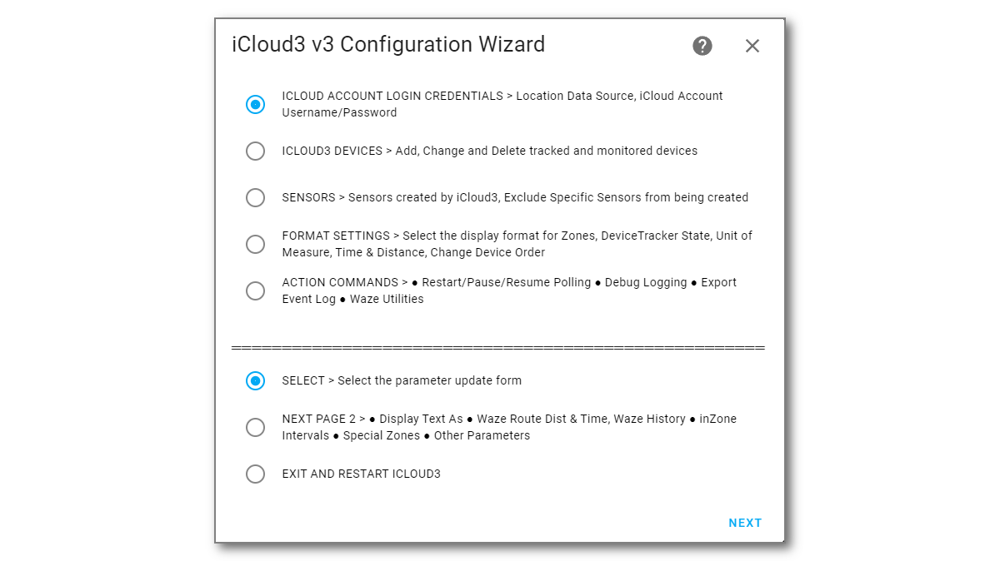
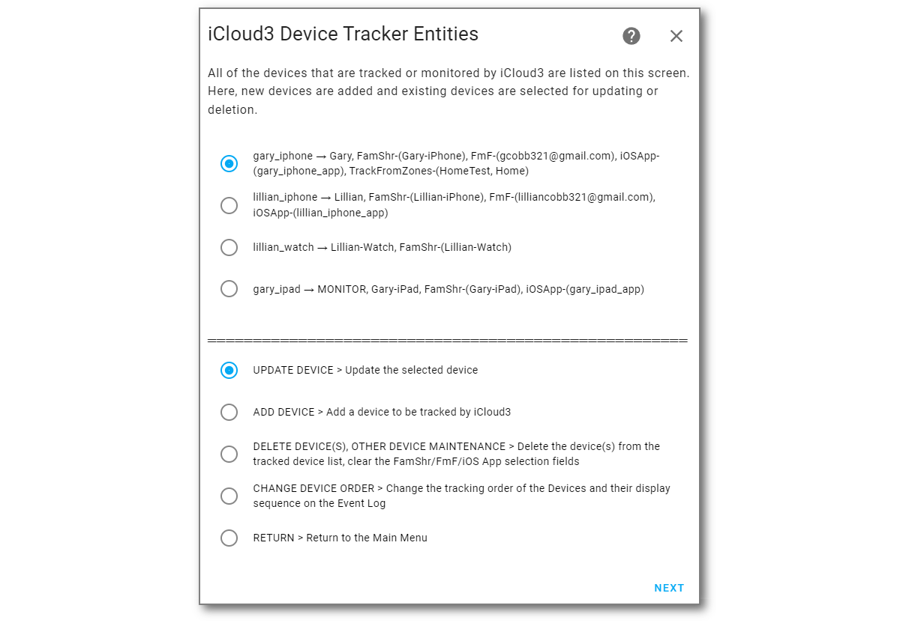
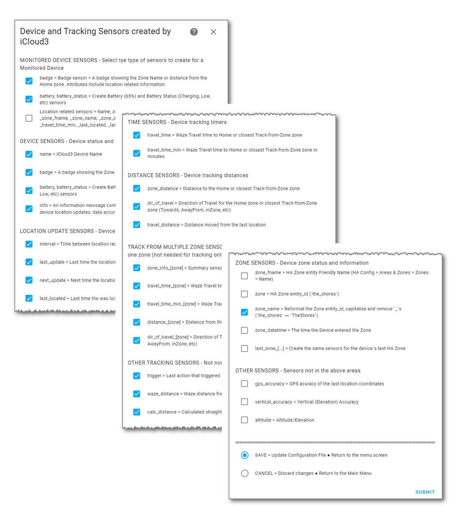

# Migrating iCloud3 from v2.4.x to v3

iCloud3 v3 is a true Home Assistant Integration that is configured on the **HA Settings > Devices & Settings > Integration > iCloud3** screen. That means the yaml parameters in the *configuration.yaml* and *config_ic3.yaml* files are no longer used or needed. 

When iCloud3 is added to HA on Integrations screen, the parameters in these files are migrated to the new internal files (*config/.storage/icloud3/configuration*). The migration should be painless but it is required that that they be reviewed before they will be used. This is done on the configuration screens using *The Configurator* described in general in the *iCloud3 Components* chapter and in detail in the *Configuration Parameters* chapter.

!> IMPORTANT - YOU MUST REVIEW THE MIGRATION RESULTS ON THE CONFIGURATION SCREENS - The 'old yaml' parameters will be migrated again and again until they are reviewed with *The Configurator*. Once the review is done, the migrated parameters (and any changes that were made) will be used. The 'old yaml' parameters can then be deleted.

Generally, you will do the following:
1. Install iCloud3 from HACS (or manually). 

   !> BETA VERSION - Follow the Beta Install Instructions instead of using HACS.

2. Add the iCloud3 integrations component (*iCloud3 Configurator*). 

3. Open *The Configurator* and review each of the screens. The most important screens are:
   - *iCloud Account Login Credentials* screen - Verify the username/password. Select *Show/Hide Username/password* in the bottom area and click *Submit* to see them.

   - *iCloud3 Devices > iCloud3 Device Tracker Entities* - Review each of the devices you are tracking. 

      The iCloud3 device_tracker entity name does not have to match the name on the iPhone or other device any longer. It can be anything you like. The FamShr (Family Sharing List members) are selected from a list using data returned from your iCloud account. The actual name on the *Settings App > General > About > Name* field (Gary-iPhone) is displayed in these lists. 
   
      Verify the selected devices are correct and reselect it if is not. Do the same for the Find-My-Friends, the iOS App and the picture that is displayed on the device_tracker entity and the badge sensor.
   
   - Go through the other screens, review the parameter values and change any that did not migrate correctly.
   
4. Exit *The Configurator*. Select *Restart Now*, then click *Submit* to restart iCloud3.

   The device_tracker and sensor entities will be recreated, tracking will resume and the Event Log will redisplay the startup process stages before the devices are relocated.

5. If everything appears to work properly, delete (or comment out) the iCloud3 v2.4 parameters in the *configuration.yaml* file.

These steps are described in detail below.

------
### Step #1 - Install iCloud3

- **Easy Way** -  Use HACS
  1. Open HACS.
  2. Select **Integrations**.
  3. Type **iCloud3** in the Search Bar at the top of the screen. 
  4. Select **iCloud3 Device Tracker**.
  5. Select **Download**, then select **Download** again in the popup window.
  6. **Restart Home Assistant**.

- **Hard Way** - Manual Installation
  1. Download the *icloud3.zip* file from the *https://github.com/gcobb321/icloud3* iCloud3 GitHub Repository.
  2. Unzip the file into the *config/sustom_components/icloud3* directory.
  3. **Restart Home Assistant**

!> AGAIN, BETA VERSION - Follow the Beta Install Instructions instead of using HACS.

------
### Step #2 - Set up the iCloud3 Integration

iCloud3 is a Home Assistant Integration and is configured on the Integrations screens.

1. Select **☰ > HA Settings > Devices & Services > Integrations**.
2. Select **+ Add Integration** in the lower-right hand corner.
3. Type **iCloud3**. Then select **iCloud3** from the list of Integrations. The iCloud3 entry will be added to the *Integrations* screen.

------
### Step #3 - Review the Configuration Parameter screens

The iCloud3 parameters need to be reviewed to verify the migration was performed correctly.

Open *The Configurator*:

1. Select **☰ > HA  Settings > Devices & Services > Integrations** if the Integrations screen is not already displayed from Step #2 above.
2. Select **iCloud3 > Configure** as shown below.

3. The Menu screen is displayed.

   

​	

#### iCloud Account & Login Credentials screen  {docsify-ignore}

1. Select **Show/Hide Username/Password** at the bottom and click **Submit** to display them. Correct them if necessary. They are hidden from view for security purposes. Additionally, the password is encrypted in the configuration file.

2. Select **Login**, then select **Submit**.  The iCloud account will be logged into and the lists of iPhones, iPads and other devices associated with the account will be set up. 

   Note: iCloud3 will attempt to do a login when the it is loaded by HA. 

#### iCloud3 Devices screen  {docsify-ignore}

All of the devices being tracked are listed on this screen. 

1. Select **Update Device**, then select **Next** to display the *Update Tracked iCloud3 Device* screen.

!> All of the devices in the *configuration.yaml* and *config_ic3.yaml* files are migrated and listed on this screen. There have been problems starting iCloud3 for the first time caused by migrating old devices, unlocatible devices and devices that no longer in an iCloud account. 

1. Select the device that is no longer wanted, select *Delete Device*.

2. Select Next to delete it.

#### Update Tracked iCloud3 Device screen  {docsify-ignore}

This screen specifies various parameters used by iCloud3 to track the device. The major parameters are:

- The Family Sharing List and the Find-my-Friends device from your iCloud account that is associated with this iCloud3 device.
- The iOS App device tracker entity tha will be monitored for location changes, zone enter/exit triggers and battery information.
- The picture to be displayed on the *device_tracker.[devicename]* entity and the *sensor.[devicename]_badge* entity.

Verify the parameters were migrated correctly and make any necessary changes.

!>  When the devices are migrated, only one device will be tracked, the others are set to *Inactive*.  There have been problems starting iCloud3 for the first time caused by migrating old devices, unlocatible devices and devices that no longer in an iCloud account. 

Review each of  the devices:

1. Set the *Tracking Mode* parameter of the devices you want to track to *Track*.

2. Make any other changes necessary.

3. Select *Save* to save the changes.

#### Sensors selection screen
This screen specifies the sensors that are created and updated during tracking. Review this screen if you have customized the sensors being used with the *create_sensors* or *exclude_sensors* parameter.

-----
### Step #4 - Exit *The Configurator* and Restart iCloud3

Since a tracked device was updated, iCloud3 will restart when you exit *The Configurator*.

1. Display the **Main Menu** screen. Select **Save**, or **Cancel**, or **Return** depending on the screen that is displayed and select **Submit**..
2. Select **Exit and Restart** on the Menu screen, then select **Next** to display the *Confirm Restarting iCloud3* screen. 

3. Select **Restart Now**, then select **Next**.
4. Select **Finish** on the final *Success, Options Successfully Saved* screen.
5. Redisplay the Lovelace screen showing iCloud3 device information you have been using and/or the Event Log.

iCloud3 will restart, the device_tracker and sensor entities are created, the device will be located and tracking will begin.

#### The Other Configuration Screens  {docsify-ignore}

Review the other screens just to see what is configurable. Nothing has to be done right now to get you up and running. The values you were using and/or default values will work fine. The other screens are shown and described in *Configuring iCloud3 using The Configurator* in the next chapter

------
### Step #5 - Clear the Browsers Cache

Since the Event Log custom card was updated, the browser's cache and the iOS App cache need to be cleared to load the new version.

#### Clear the Browser's Cache (Chrome, Edge, Safari, MacOS) {docsify-ignore}

The browser (Chrome, Edge, Safari) stores the Home Assistant screens in it's cache. This needs to be cleared to load the new version of the Event Log card.

1. Press **Ctrl-Shift-Delete**.
2. Select **Cached Images and Files**, the select **Clear Data** (the text may vary depending on the browser being used).
3. Return to the Lovelace screen with the Event Log and click the browser's **Refresh Icon**. 

Note: This process may be different for MacOS.

#### Clear the Home Assistant Companion (iOS App) Cache  {docsify-ignore}

<u>The cache also needs to be cleared on every of the devices</u> (iPhones, iPads) running the Home Assistant Companion app. 

1. In the *Home Assistant Companion App*, tap **☰ > HA Settings > Companion App.**
2. Tap **Debugging > Reset front end cache**
3. Tap **Settings > Done**
4. Redisplay one of the Lovelace screens and pull it down to reload the screens.

------
### Step #6 - Restart Home Assistant (if necessary)

***If you successfully added the Lovelace tracking and Event Log cards and the tracking data is displayed, you are done.***

Otherwise, restart  Home Assistant to make sure iCloud3 starts, tracking begins and the Tracking and Event Log screens display correctly. 

As usual, when iCloud3 starts, it follows a startup process to:

- Check the directory settings
- Load the configuration parameters
- Load the tracked and monitored devices
- Access the your iCloud account to get the devices tied to your account
- Get the information for the devices using the HA Companion App
- Tie everything together
- Start tracking. 

The results of this process are shown in the Event Log and described in *Event Log During Startup* in the *How to Configure iCloud3*  chapter. 

- Check the Event Log (it should display something) for error messages.
- Check the HA Log file (*config/home-assistant.log*)
- Verify that the device_tracker and sensor entities are set up. The *Devices & Settings > Integrations > iCloud3* entry should show at least one device_tracker and some entities for that device.

