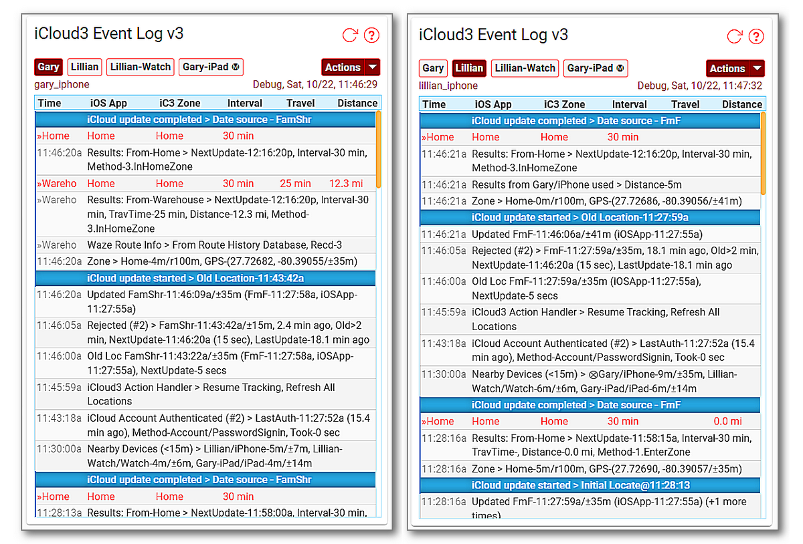

# iCloud3 Components

There are 3 major parts to the iCloud3 custom component that are used to configure, track and report device location information. They are:

- iCloud3 Custom Component 
- Event Log
- The Configuration Wizard

This section describes each of the items.

------

### iCloud3 Custom Component

The iCloud3 Custom Component provides the core device tracking service. It does the following:
  - Initializes and sets up all tracking activities using the device configuration data from the iCloud account.
  - Monitors the iOS App device_tracker entity for location changes, zone enter/exit triggers and battery information.
  - Requests and processes location data from iCloud Location Services and the iOS App.
  - Analyzes the location data and tracks the devices.
  - Updates the sensors associated with each device.

  The iCloud3 files are installed in the *config/custom_components/icloud3* directory. 

The example screens below show examples of a tracked device's current status. The following is displayed:

- Notice the distance, travel time and travel direction from the Home Zone. 
- Notice when the device was last located by iCloud or the iOS App, when it was last updated by iCloud3 and the time of the next update. 
- Gary is tracking from Home and the Warehouse Zone, Lillian just from Home.
- The *Info* field shows tracking results from nearby devices is being used.

Note: The Lovelace code for these screens is in [Step #5 - Set up a Lovelace card tracking card](.../2.0-installing-and-configuring?id=step-6-set-up-a-lovelace-card-tracking-card) 

------

### Event Log

The Event Log is a Lovelace custom card that shows past and current activity related to tracking a device. This includes:

- Startup configuration.
- Device information for Family Sharing, Find-my-Friends and iOS App devices and entities.
- Tracking results including zone, travel time and distance data.
- Error messages, problems and location data issues.
- Detail tracking monitors that show what is going on under the covers, how location data from the iCloud Location Services and the iOS App is analyzed and processed.

The Event Log has an *Actions* command menu that can control iCloud3 operations and the type of information to display in the Event Log or the Home Assistant log file. This includes:
- Restart iCloud3 without restarting Home Assistant
- Pause and resume tracking
- Relocate all devices
- Issue a *Find My Device* alert
- Export the Event Log to a text file
- Show/hide tracking monitors
- Start/stop detailed debugging that will dump set up information and all raw data received from iCloud Location Services.

Note: The Event Log is installed into the *config/www/icloud3* directory. This directory can be changed on the *Configuration Wizard > Tracking & Other Parameters* screen on Menu page #2.

------

### iCloud3 Configuration Wizard

*The Configuration Wizard* is used to configure iCloud3 parameters.  It is opened on the **☰ > HA Settings > Devices & Services > Integrations** screen. Select **iCloud3 - Settings Icon** in the upper-right, then select **Configure** on the iCloud3 Integrations entry screen.

*The Configuration Wizard* consists of 2 menus and 10+ parameter entry screens. Each screen has two parts:

- **Selection or parameter entry (top part)** - This is used to select a task to be done, an item to be selected or an option list/text field for the parameter being configured.

- **Command or Action to be done (bottom part)** - First select the desired option (Select/Next/Add/Update/Delete/etc.), then select the command in the bottom right-hand corner of the screen (Next/Submit/Finish/etc.).

The example screens below show these 2-sections. These and the other screens are described in detail in the *Configuring iCloud3 Parameters* chapter.

#### Update Configuration Main Menu screens

The menus are used to select the specific update screen.

#### Update Tracked Device screens

Adding a new devices and updating an existing device is done on this screen.

#### Format Settings screen

Configuring how information should be displayed in the device_tracker and sensor entities and on the Event Log screen. 

