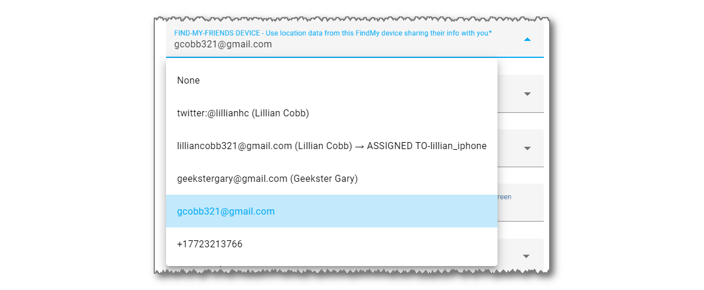
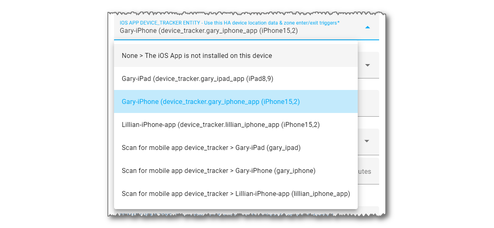

#  Location Data - iCloud Account & iOS App

iCloud3 uses location data from the Apple iCloud account and the Home Assistant Companion App.  It requests the location from the iCloud account at a predetermined time based on the the device's location, the distance from the Home or other tracked zone and the travel direction. iCloud3 may also request the location from the iOS App but normally, it monitors location and zone changed sent from the app to Home Assistant. 

This section describes:

- iCloud Account - Tracking methods providing location data

- iOS App - Monitored sensors and location update process

- Tracking Methods - Sources of location data and how they are associated with the iCloud3 device_tracker entity

  - Family Sharing list devices

  - FindMy devices

  - Devices running the iOS App

    

------

### Location Data - iCloud Account

The iCloud Account is the primary source of location data. It provides information related to the iPhones, iPads and other devices in the Family Sharing list and sharing their location. 

- Setting up access to the iCloud account (username/password) and authentication (6-digit verification code entry) is described in *Installing and Configuring iCloud3 > Step 5 - Configuring iCloud3*.

> In China, different URLs are used to access the iCloud servers. The location of the device running Home Assistant provides (Raspberry Pi, Mac, etc.) is checked when iCloud3 starts and, if it is in China, all location requests are rerouted to the correct URL.

The two tracking methods that provide location information are:

- **Primary Location Request Method - Family Sharing (FamShr) list member**s - The location of all devices (iPhones, iPads, AirPods, Watches) in the Family Sharing list is provided when a request is made for just one device. iCloud3 takes advantage of this and updates the location of all of the tracked devices. The Apple iCloud account administrator's location is only available using this location request. 

  The selection list below shows the device's name in the *Settings App > General > About*  Name field on the device (Gary-iPhone), the device type (iPhone 14 Pro) and Apple model name (iPhone15,2).

  

  

  > !In May, 2023, Apple no longer provided web access to the Find-my-Friends location data so the Find-my-Friends data source is no longer used by iCloud3. It has not been removed from the documentation (yet) with hopes that it will be made available or the way to access it will be found.

- **Secondary Location Request Method - Find-my-Friends (FmF)** - This method is used for devices that are not in the Family Sharing list. It provides the location of the devices (people/friends) that have shared their location with you on the FindMy app. The email address or phone number of the friend identifies the device. 

  The Find-my-Friends device is also assigned to an iCloud3 device on the *iCloud3 Devices > iCloud3 Device Tracker Entities > Update Tracked iCloud3 Device* screen.
  

**Sharing a Friends Location** - To add someone to <u>your</u> Find-my-Friends list, on <u>their</u> phone:

1. On the **FindMy App**, tap **People** or **Devices**.
2. Tap **+ (Plus Sign)**, then tap **Share My Location**.
3. Select your email address or phone number or enter it in the **To:** field at the top of the screen, then tap **Send** to send <u>you</u> an approval invitation.

------

### Location Data - Home Assistant Companion App (iOS App)

The iOS App can be installed on iPhones and iPads to monitor the device's location and provide zone enter/exit triggers. It will:

- **Issue a Zone Enter/Exit trigger when it enters or exits a zone** - This trigger is immediately received by iCloud3, analyzed and the device's location will be updated. 
- **Update the device's location** -  iCloud3 monitors the iOS App location data and updates the tracking information. 

There may be times when the device is in a zone, an 'out-of-zone' location is received and an Exit trigger had not been sent. This *GPS wandering* event is discarded, preventing zone exit automations from being triggered by Home Assistant. the iCloud3 sensors will remain in an 'in-zone' state while the iOS App sensors have changed to an 'away/not_home' state.

- Instructions for installing and configuring the iOS App are in the *Installing and Configuring iCloud3 > Step 2 - Installing the iOS App*.

- The official documentation for the iOS App (Home Assistant Companion) can be found [here](https://companion.home-assistant.io/).  

The iOS App device is assigned to an iCloud3 device on the *iCloud3 Devices > iCloud3 Device Tracker Entities > Update Tracked iCloud3 Device* screen. 

iCloud3 does not require the iOS App to be installed on an iPhone or iPad. However, if it is not installed, the following happens:

- iCloud3 will not react to a Zone Enter or Exit events until the phone's *Next Update Event* time. This will delay the device entering a zone or exiting from it.
- Significant location changes will not be available.
- The device's battery level is not available.
- Notifications can not be sent to the device.
- In this case, a short *inZone Interval* will help reduce the time between location updates.

------

### Tracking an Apple Watch and AirTags

**Apple Watch** - The iOS App Complication can be installed on the Apple Watch, however:

- It does not provide location information.
- It will not receive notifications sent from iCloud3.
- Set the *iOS App device* to *None*
- Set the *inZone Interval* to 15-minutes to minimize the delay when the device enters or exits a zone.
- Only assign a *Family Sharing* device to the tracked Watch device.

**Apple AirTags** - These devices can not be tracked. They are not tracked by Apple like an iPhone or iPad and location information is not returned from iCloud Location Services for them.

------

### When a Device is Upgraded (Ex.: iPhone 13 to iPhone 14)

The FamShr device's name (*Gary iPhone*) selected from the above list is stored in the iCloud3 configuration file. This is used to determine the actual Apple device providing location data when iCloud3 starts.

Several events take place when you upgrade a device, i.e, replace an iPhone 13 Pro with an iPhone 14 Pro. 

- The apps, data and settings are transferred from the iPhone 13 Pro to the iPhone 14 Pro.
- In this example, the name is on the iPhone 13 Pro is *Gary iPhone*. 
- A new name is assigned to the iPhone 14 Pro, i.e, *Gary iPhone (2)*.
- The iPhone 14 is assigned a new *device_id* by Apple. This *device_id* is used internally by Apple and you never see it. It is used, however, by iCloud3 to identify the actual device providing location data.
- The iPhone 13 Pro is removed from the FindMy App and the Apple iCloud account and traded-in or sold.

At this time, iCloud3 is still tracking the *Gary iPhone* iPhone 13 Pro that is no longer on your iCloud account instead of the new iPhone.

**Easy way** - The following steps should be done to make it easier to identify and transfer to the new iPhone:

- Rename the iPhone 13 Pro from *Gary iPhone* to *Gary iPhone 13*. 
- Rename the iPhone 14 Pro from *Gary iPhone 13 (2)* back to *Gary iPhone* after you transfer the apps, data and settings.
- Restart iCloud3.

Since the new iPhone 14 Pro is now the *Gary iPhone* device, it will be now be assigned to the same iCloud3 tracked device.

**Harder way** - You realize that *Gary iPhone* is no longer being tracked because the iPhone is no longer on your Apple iCloud account or it has been wiped and powered off. 

- Restart iCloud3. The Family Sharing list will be rebuilt with the current name.
  - Select the new iPhone from the Family Sharing list on the *iCloud3 Devices > iCloud3 Device Tracker Entities > Update Tracked iCloud3 Device* screen. 
  - Restart iCloud3 again. The new iPhone's name will be assigned to the iCloud3 tracked device.
- Or, 
  - Change the name on the iPhone 14 Pro from *Gary iPhone (2)* to *Gary iPhone*.
  - Wait a few minutes until this name is re-registered with the Apple account.
  - Restart iCloud3 to reassign the name to the iCloud3 tracked device.

The device type (iPhone 14 Pro) and Apple model number (iphone15,2) is shown on the device list to help identity the actual device.

