# Installing and Configuring iCloud3

There are several steps that that need to be done to install and start using iCloud3 to track your devices. They are:

1. Install iCloud3 from HACS (or manually).
2. Install and configure the HA Companion App (iOS App).
3. Set up the Event Log Lovelace card component.
4. Add the iCloud3 integrations component (iCloud3 Configuration Wizard). 
5. Open *The Configuration Wizard*, set up your Apple iCloud account and add your iPhone to the tracked device list. 
6. Add your Apple iCloud account credentitials and authenticate access to your account.
7. Set up a Lovelace card for for your iPhone.
8.  Set up a Lovelace card for the Event Log.
9. Restart Home Assistant.

These steps are described below.


------
### Step #1 - Install iCloud3

- **Easy Way** -  Use HACS
  1. Open HACS.
  2. Select **Integrations**.
  3. Type **iCloud3** in the Search Bar at the top of the screen. 
  4. Select **iCloud3 v3 Device Tracker**.
  5. Select **Download**, then select **Download** again in the popup window.
  6. **Restart Home Assistant**.

- **Hard (but not too hard) Way** - Manual Installation
  1. Download the *icloud3.zip* file from the iCloud3 GitHub Repository Released Page [here](https://github.com/gcobb321/icloud3_v3/releases). Selects *Assets* at the bottom, then the zip file. The file save screen will be displayed, select the location on your computer and save the zip file.
  2. Unzip the file into the *config/custom_components/icloud3* directory on your Home Assistant server (ex.: Raspberry Pi)
  3. **Restart Home Assistant**


------
### Step #2 - Install the iOS App on your iPhone or iPad

The iOS App is not required for iCloud3 to track devices. But it helps and it's benefits have already been discussed. It can be installed on some iPhones and not others. You can, for example, install it on your iPhone and not your wife's. 

The official documentation for the iOS App (Home Assistant Companion) can be found [here](https://companion.home-assistant.io/).  Select *Getting Started* for instructions on installing and configuring the iOS App.

The iOS App must be configured to provide location and zone activity to Home Assistant. The screen below shows the correct settings:

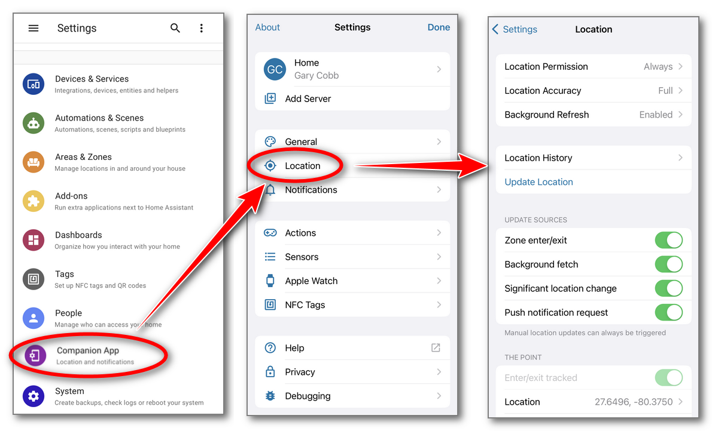


------
### Step #3 - Add the iCloud3 Integration and open the *Configuration Wizard*

iCloud3 is a Home Assistant Integration and is configured on the Integrations screens like all the other Integrations you may be using.

1. Select **☰ > HA Settings > Devices & Services > Integrations**.
2. Select **+ Add Integration** in the lower-right hand corner.
3. Type **iCloud3**. Then select **iCloud3 v3** from the list of Integrations. *Do not select iCloud3, it is v2.4.* The iCloud3 v3 entry will be added to the *Integrations* screen.

The iCloud3 parameters need to be reviewed to verify the migration was performed correctly.

Open *The Configuration Wizard*:

1. Select **☰ > HA  Settings > Devices & Services > Integrations** if the Integrations screen is not already displayed.
2. Select **iCloud3 > Configure**.


​		3. Selecting **Configure** will open the *iCloud3 Configuration Wizard* menu screen on the left.

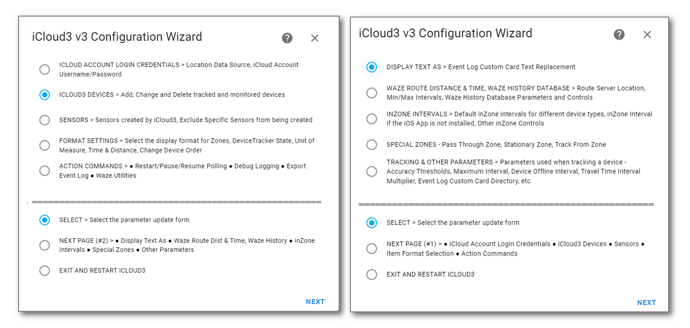

There are 10-parameter screens on 2-menu pages that are used to display and update the parameters. The name of the screens are displayed at the top, the Action to be performed is displayed at the bottom. All update screens follow this same format.

Only two of the parameter screens are needed to be set up for iCloud3 to start tracking devices. The default values on the other screens will be fine for now. You will want to review them and tailor the parameters for your needs later.

1. *iCloud Account & Login Credentials* screen - Add the username and password settings for your Apple iCloud account.
2. *iCloud3 Devices* screen - Add, update and delete devices that will be tracked by iCloud3. 


#### Step #3.1 - iCloud Account Login Credentials screen

This screen is used to indicate the data source used for location information (iCloud, iOS App) and the username/password of your Apple iCloud account.

1. Select the **Password Display Icon** at the end of the username and password fields to display their values. Correct them if necessary. 
2. Select **Login**, then select **Submit**.  The iCloud account will be logged into and the lists of iPhones, iPads and other devices associated with the account will be set up. 
3. Select **Save**, then select **Submit** to return to the menu.

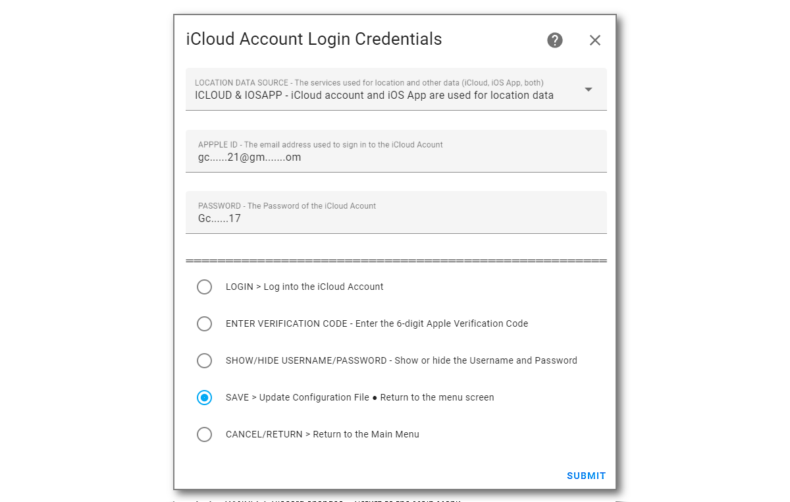

Notes:

1. When iCloud3 starts, you are logged into your Apple iCloud account. The account username/password is shown on the *LOGIN Action* line (gc......@gm......./Gc......).
2. The password is encrypted when it is saved in the configuration file
3. The username and password are not required if you are only tracking with the iOS App,
4. Apple account authentication - If you are signing into the Apple iCloud Account for the first time, the account access token has expired or your account username or password has changed and you will get an alert on your phone or other device that someone is signing into your Apple account. 
   1. Select **Allow** on your phone or other trusted device, the screen showing the 6-digit verification code is displayed
   2. The code entry form below should display on your computer. If it does not, select *Enter Verification Code*, then select Submit.
   3. From time-to-time, you will have to reauthenticate iCloud3's access to your Apple iCloud account. This is discussed later. 
   4. Enter the 6-digit verification code, then select *Submit*.

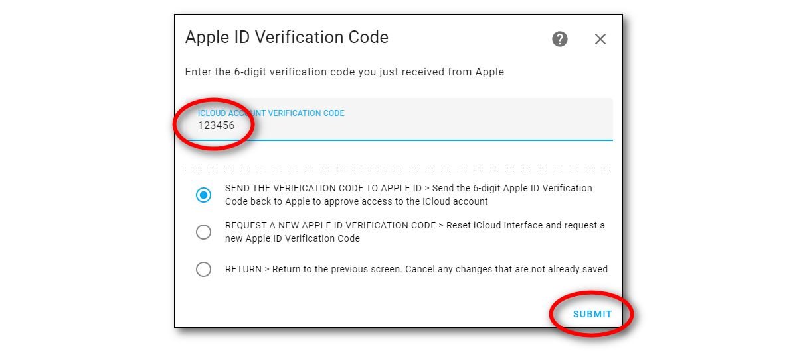


#### Step #3.2 - iCloud3 Devices screen

Up to 10-devices can be tracked by iCloud3. They are shown on this screen.  Since no devices have been set up, the list is empty and *Add Device* is selected.

1. Select **Add Device**, then select **Next** to display the *Add Device* screen

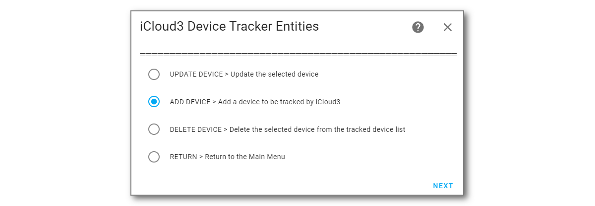


#### Step #3.3 - Add Tracked iCloud3 Device screen

New iCloud3 tracked devices are added on this screen.

1. Assign a  **iCloud3 Device Name** to the device (*gary_iphone*). This will create the *device-tracker.[devicename]* entity and the *sensor.[devicename]_[sensorname]* entities for this device.

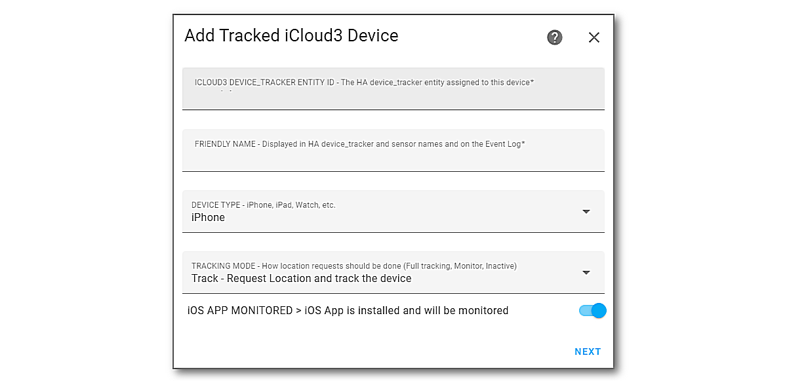

2. Type the **Friendly Name** (*Gary*) and change the **Device Type** if necessary.


3. Select **Next** to display the *Update Tracked iCloud3 Device* screen to enter the rest of the parameters.

Notes:

1. The *Tracking Mode* field describes how the device will be tracked: 

   - **Track** - Request the location and track the device,

   - **Monitor** - Do not request the location. Report it's location when it is requrned from an iCloud location request for another device.

   - **Inactive** - Not tracked or monitored. This option keeps the device's parameters in the the configuration file but does not track it. 


#### Step #3.4 - Update Tracked iCloud3 Device screen

This screen specifies various parameters used by iCloud3 to track the device. The major parameters are:

1. The Family Sharing List and the Find-my-Friends device from your iCloud account that is associated with this iCloud3 device.
2. The iOS App device tracker entity tha will be monitored for location changes, zone enter/exit triggers and battery information.
3. The picture to be displayed on the *device_tracker.[devicename]* entity and the *sensor.[devicename]_badge* entity.

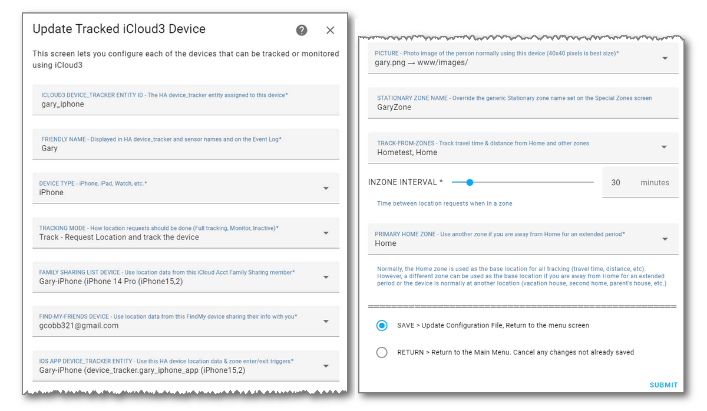

1. Select and enter the parameters for this device.
2. Select **Submit** to add the device. It will be added to the *iCloud3 Device Tracker Entities* screenn.

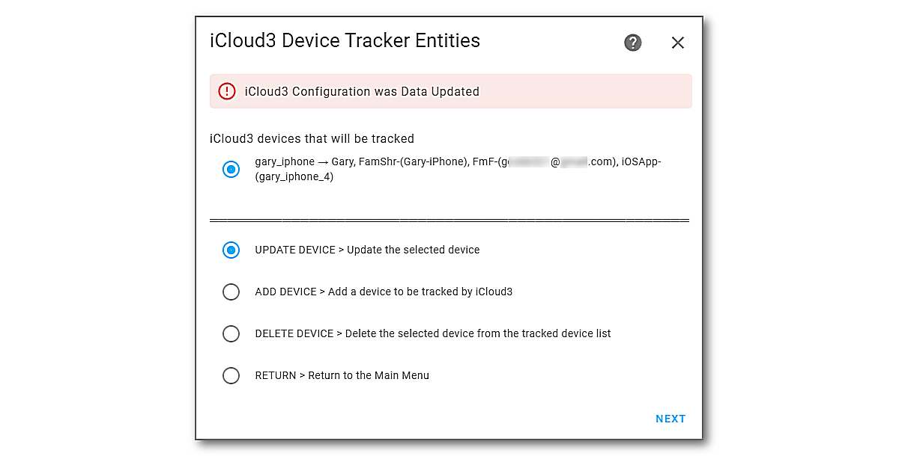

!> At this time, it is advisable to only set up the main device associated with the Apple iCloud account. This will make sure iCloud3 is up and running, the device_tracker and sensor entities are being created, the Lovelace sensor screens are showing the correct information, the Event Log is operational before continuing and you have become familiar with the Configuration Wizard and iCloud3.

Notes:

1. The Find-my-Friends (FmF) data source will not be used if all of the devices being tracked are on the Family Sharing list and does not have to be updated.

-----

### Step #4 - Exit *The Configuration Wizard* and Restart iCloud3

Since a tracked device was updated, iCloud3 will restart when you exit *The Configuration Wizard*.

1. Display the **Main Menu** screen. Select **Save**, or **Cancel**, or **Return** depending on the screen that is displayed and select **Submit**..
2. Select **Exit and Restart** on the Menu screen, then select **Next** to display the *Confirm Restarting iCloud3* screen. 

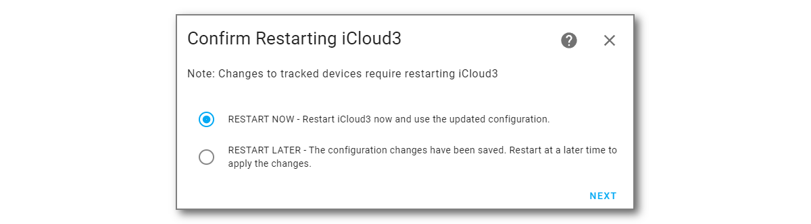

3. Select **Restart Now**, then select **Next**.
4. Select **Finish** on the final *Success, Options Successfully Saved* screen.
5. Redisplay the Lovelace screen showing iCloud3 device information you have been using and/or the Event Log.

iCloud3 will restart, the device_tracker and sensor entities are created, the device will be located and tracking will begin.


#### The Other Configuration Screens  {docsify-ignore}

Review the other screens just to see what is configurable. Nothing has to be done right now to get you up and running. The default values will work fine. The other screens are shown and described in *Configuring iCloud3 using The Configuration Wizard* in the next chapter


------
### Step #5 - Set up a Lovelace card tracking card

The following tracking screens show the current status for Gary's iPhone (*gary_iphone*).

-  **Left Side** - Shows the device_tracker and various sensor entities for the two devices showing the distance and travel time from Home, the interval between location requests and when the next request will be made, the battery level, and when it was last located.
- **Right Side** - The Event Log for Gary while traveling towards home.

The steps for adding this to the Lovelace dashboard are below, followed by the yaml code that created them. You will obviously need to change the entity names of *gary_iphone* to your phone in the yaml code.

!> The *Event Log card* is a Lovelace custom card. In order to set it up, it must be added to the Lovelace Resources. iCloud3 automatically adds it to the Lovelace Resources when it starts so nothing should need to be done.  Manual instructions on doing this are at the end of this chapter in case it is not added correctly or an error occurs.


The yaml code for this is shown below. 

```yaml
title: iCloud3
views:
  - title: iCloud3
    cards:
      - square: false
        columns: 1
        type: grid
        cards:
          - type: glance
            state_color: true
            show_name: true
            show_icon: true
            show_state: true
            columns: 5
            entities:
              - entity: device_tracker.gary_iphone
                name: Gary
              - entity: sensor.gary_iphone_zone_distance
                name: Distance
              - entity: sensor.gary_iphone_travel_time
                name: TravTime
              - entity: sensor.gary_iphone_interval
                name: Interval
              - entity: sensor.gary_iphone_next_update
                name: NextUpdt
          - type: glance
            columns: 5
            entities:
              - entity: sensor.gary_iphone_battery
                name: Battery
              - entity: sensor.gary_iphone_dir_of_travel
                name: Direction
              - entity: sensor.gary_iphone_moved_distance
                name: Moved
              - entity: sensor.gary_iphone_last_located
                name: Located
              - entity: sensor.gary_iphone_last_update
                name: LastUpdt
          - type: entities
            entities:
              - entity: sensor.gary_iphone_info
                name: Info - Lillian
                icon: mdi:information-outline
                
      - type: grid
        square: false
        columns: 1
        cards:
          - type: custom:icloud3-event-log-card

```

To create this Lovelace screen, do the following:

- Create the iCloud3 Panel that will sit in the HA toolbar along the left-side of the screen.

  1. Select **☰ > HA Settings > Dashboards**.

  2. Select **+ Add Dashboard** in the lower-right hand corner. The Add New Dashboard screen is displayed.

     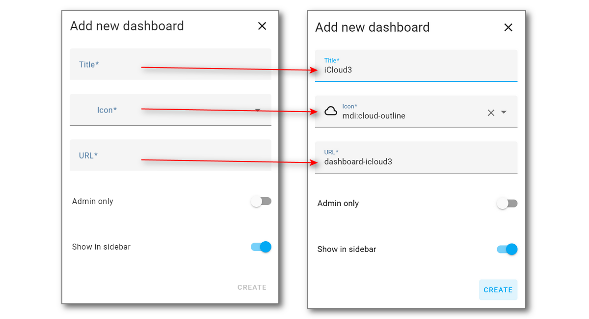

  3. Enter the following:

     - **iCloud3** in the *Title* field
     - **mdi:weather-cloud-outline** in the *Icon* field
     - **dashboard-icloud3** will be automatically filled in into the *URL* field

  4. Select **Create**. The Dashboard list screen is redisplayed.

- Create the actual Lovelace iCloud3 panel screen that shows the tracking information for Gary and the iCloud3 Event Log custom card above:

  1. Select **'⋮' (Upper right corner) > Edit Dashboard** as you normally do to create or update a Lovelace card. The *Take control of your dashboard* screen is displayed.

     - Select **Start with an empty dashboard**
     - Select **Take Control**

     A blank *Edit Dashboard* screen is displayed

  2. Select **'⋮' (Upper right corner) > Raw configuration editor** and a blank *Edit Configuration* is displayed. Ignore the **+  Add Card**. 

  3. Copy all of the code in the above code block and past it into the Edit Configuration window. 

     - Erase the following code that HA adds to the beginning of the Lovelace yaml code editor:	

     ```
     views:
       - title: Home
     ```

     - And copy the code snippet above. It should now look like:

     ```
     title: iCloud3
     views:
       - title: iCloud3
         cards:
     .
     .	<<< Rest of the code in the above code snippet >>>
     .
           - type: grid
             square: false
             columns: 1
             cards:
               - type: custom:icloud3-event-log-card
     ```

     

  4. Select **Save**, then select the '**X**' next to Edit Configuration in the upper-left, then select **Done**.


#### Setting up the *icloud3-event-log-card* Lovelace Resource

The Lovelace Resources points to the location of the *icloud3-event-log-card.js* file and must be set up for the Event Log to be displayed.  If a problem occurs setting up the Lovelace Resource automatically, the Event Log (on the right in the above screenshot) will not be displayed and the following will be displayed instead:


Do the following to set it up manually:

1. Select **☰ > HA Settings > Dashboards > ⋮ (Upper right corner) > Resources**. The following screen is displayed:

   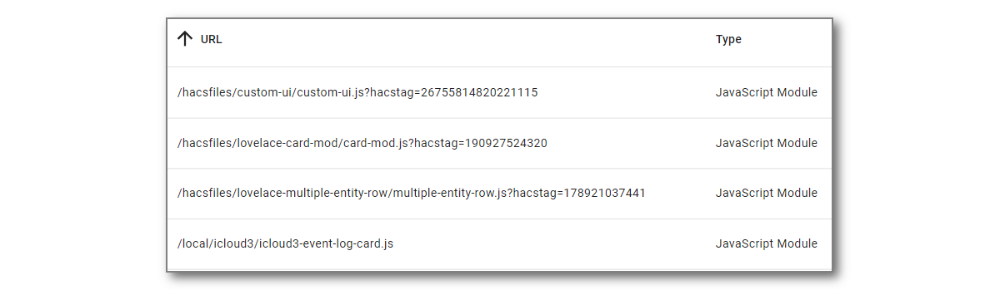

2. Select **+ Add Resource** to open the Add Resources window (on the left).


3. Enter the following:

   - **/local/icloud3/icloud3-event-log-card** in the **URL** field
   - Check **JavaScript Module**
4. Select **Create (or Update)**

> *Note: Using another custom card directory* - If you move the Event Log card to another directory, the Lovelace Resources should automatically be changed. If something happens and it is not changed, change the directory (*icloud3*) in the URL statement on the above screen to the new directory name. Then select the new directory name in the *Event Log Directory* field on the *iCloud3 Configuration Wizard > Menu Page 2 > Other Parameters*  screen.


------
### Step #8 - Congratulations, iCloud3 is set up

 If you successfully added the Lovelace tracking, Event Log card and the tracking data is displayed, you have successfully set up iCloud3 and Home Assistant does not have to be restarted, Review the rest of the documentation and the parameter screens


-----

### Installation Notes

The following Installation Notes are not part of the actual installation process but may be useful.

### Restart Home Assistant (if necessary)

If something does not work, errors or alerts are displayed or iCloud3 does not begin tracking devices, restart Home Assistant may solve the problem.

When iCloud3 starts, it follows a startup process to:

- Check the directory settings
- Load the configuration parameters
- Load the tracked and monitored devices
- Access the your iCloud account to get the devices tied to your account
- Get the information for the devices using the HA Companion App
- Tie everything together
- Start tracking. 

The results of this process are shown in the Event Log and detailed in *Event Log During Startup* in a previous chapter. 

- Check the Event Log (it should display something) for error messages.
- Check the HA Log file (*config/home-assistant.log*)
- Verify that the device_tracker and sensor entities are set up. The *Devices & Settings > Integrations > iCloud3* entry should show at least one device_tracker and some entities for that device.


-----

### Clearing the Browser's Cache

When the a new version of the *Event Log card* is installed, it is not automatically loaded by your browser or the iOS App. The browser's cache needs to be cleared.

#### Clear the Browser's Cache (Chrome, Edge, Safari, MacOS) {docsify-ignore}

The browser (Chrome, Edge, Safari) stores the Home Assistant screens in it's cache. This needs to be cleared to load the new version of the Event Log card.

1. Press **Ctrl-Shift-Delete**.
2. Select **Cached Images and Files**, the select **Clear Data**
3. Return to the Lovelace screen and click the **Refresh Icon**. 

Note: This process may be different for MacOS.


#### Clear the Home Assistant Companion (iOS App) Cache  {docsify-ignore}

<u>The cache also needs to be cleared on every of the devices</u> (iPhones, iPads) running the Home Assistant Companion app. 

1. In the *Home Assistant Companion App*, tap **☰ > HA Settings > Companion App.**
2. Tap **Debugging > Reset front end cache**
3. Tap **Settings > Done**
4. Redisplay one of the Lovelace screens and pull it down to reload the screens.

-----

### iCloud3 Debug Log

iCloud3 writes logging records to it's *icloud3-debug.log* file. This includes:

- **info** - Informative messages that display tracking results and some messages on it's operations,
- **debug** - Debug messages that provide a lot more information on the data received from the iOS App and the iCloud account, it's operational status, error messages and other records on how the devices are being tracked,
- **rawdata** - Rawdata messages log the actual records sent to and received from the iCloud account, actual data received from the iOS App, how zones, devices and sensors are set up and event activity during when iCloud3 is starting.

These records are written to the *config/icloud3-debug.log* file.

Normally, the *info* log level is used. However, when a new version of iCloud3 is installed, the *debug* log level is operational for 5-days. This can provide the information necessary to identify and solve setup, configuration, device assignment,and other errors that may be encountered during this period.
