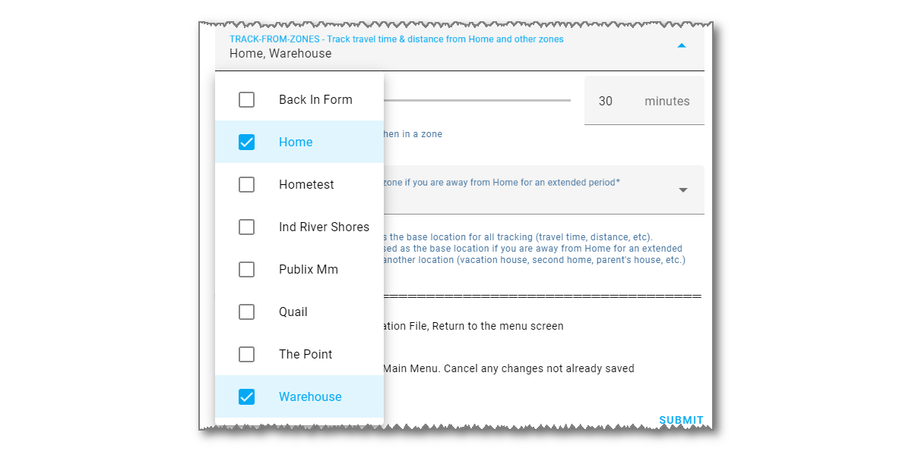

# Other Features


------

## Tracking From More Than One Zone

Normally, you track a device from the Home Zone. The sensor entities for travel time, distance, intervals, next update time, etc. are calculated for the Home Zone. iCloud3 also lets you track a device from another zone. It will calculate the same type of sensor entities for that zone. 

To track from another zone, select that zone in the *Track from Zones* parameter on the *Update Tracked iCloud3 Device* screen. 

1. Select the *iCloud3 Devices* screen.
2. Select the device to be tracked from the other zone.
3. Select the *Track-from-Zones* field, then select the zones to be tracked from.



New sensors are created for all of the track-from-zones.

- **Sensor Entities** - The zone name is added to the end of the entity name.
  - Home Zone -*sensor.gary_iphone_travel_time_home, sensor.gary_iphone_zone_distance_home*, etc.
  - Warehouse Zone - *sensor.gary_iphone_travel_time_warehouse, sensor.gary_iphone_zone_distance_warehouse*, etc.

- **Sensor's Friendly Name** - The zone's display-as friendly is added to the end of the sensor friendly name:
  - Home Zone - Gary TravelTime (Home), Gary ZoneDistance (Home), etc.
  - Warehouse Zone - Gary TravelTime (Warehouse), Gary ZoneDistance (Warehouse), etc.

The Track-from-Zone sensors mentioned above are optional, only the sensors that will be displayed on a Lovelace card or used in an automation need to be created.  They are selected on *iCloud3 Configurator > Sensors* screen.


The sensors created when only tracking from the Home zone (*sensor.gary_iphone_travel_time, sensor.gary_iphone_zone_distance, etc.*) have changed:

- Closer to the Home zone - Show the Home zone information
- Within 8km of the Other zone and going towards it - Show the Other zone's information
- Within 8km of the Other zone and going away from it - Show the Home zone's information
- Going towards both zones - Show the Home zone's information if more than 8km away from the Other zone
- Other zone's information is displayed - It's first initial is displayed in the *distance* sensor (🅦 is shown for the Warehouse zone).


------

## Display the Waze History Locations on a Map Card

Use the *sensor.icloud3_wazehist_track* sensor entity as the source of a Lovelace map card to see the locations of all of the 11m locations points that have been saved. 

Create a Lovelace map card:


Or copy the yaml code below into the *Show Code Editor* yaml code field on a new Lovelace card.

```type:yaml
type: map
entities:
  - entity: sensor.icloud3_wazehist_track
hours_to_show: 24
```

After the location data has been loaded into the sensor, the resulting map card looks similar to the map below. 


> This really does not have any practical use but it was a fun project to see how many locations had been saved.

Each of the dots on the map is a saved location. Unfortunately, Home Assistant treats the locations on the map card as a tracking point and draws a line between the points in the order they were loaded. Ignore the lines.

To try to display the points in a logical order based on your most frequent driving direction, select *North-South* or *East-West* in the *Waze Location Map Display* field on the *Waze - History Database* parameter screen.


### How to Remove the Lines Between the Locations  {docsify-ignore}

The lines between the locations dots can be removed using the *card-mod* Lovelace custom style developed by Thomas Loven. With *card-mod*, custom CSS styles can be applied to various elements of the Home Assistant frontend (element colors, icons, borders, etc.). Information about *card_mod* can be found [here](https://github.com/thomasloven/lovelace-card-mod/blob/master/README.md).

> Using this custom style, the North-South and East-West track direction is irreverent since the lines between the locations is not displayed.

The installation is described in the *card-mod* documentation and below.

1. Install *card_mod* with Hacs. (Hacs > Frontend > Search for *card-mod* > Lovelace > Download)

2. Add the following to your `configuration.yaml` file and restart Home Assistant.

   ```
   frontend:
     extra_module_url:
       /hacsfiles/lovelace-card-mod/card-mod.js
   ```

   Change the path if you have moved the *card-mod.js* file to another location. If you installed through HACS, it is probably `/hacsfiles/lovelace-card-mod/card-mod.js`.

3. Edit the Lovelace map card configuration parameters described above.

   ```type:yaml
   type: map
   entities:
     - entity: sensor.icloud3_wazehist_track
   hours_to_show: 24
   card_mod:
     style:
       ha-map$:
         .leaflet-pane: |
           path {
             fill: red;
             stroke: none;
           }
         .leaflet-overlay-pane: |
           path {
             fill: red;
             stroke: none;
           }
   ```


After the location data has been loaded into the sensor, the map card now looks like this.


### Loading the saved locations  {docsify-ignore}

The saved locations are loaded into the *sensor.icloud3_wazehist_track* sensor entity several ways.

- Each night at midnight.
- Immediately by selecting *Event Log > Actions > WazeHist - Load track locations for map*
- Immediately by selecting *iCloud3 Configurator > Actions > Waze Hist Map Track - Load route locations for map display*

