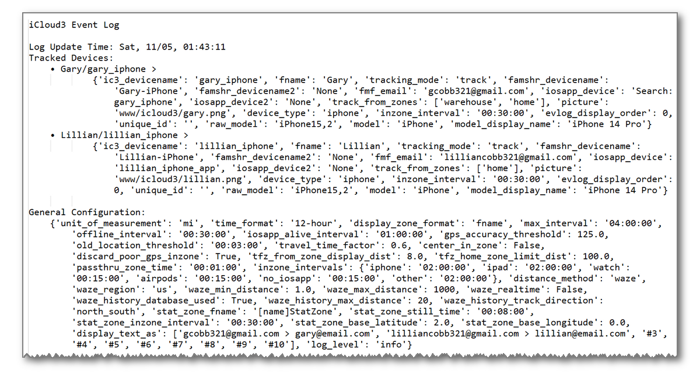
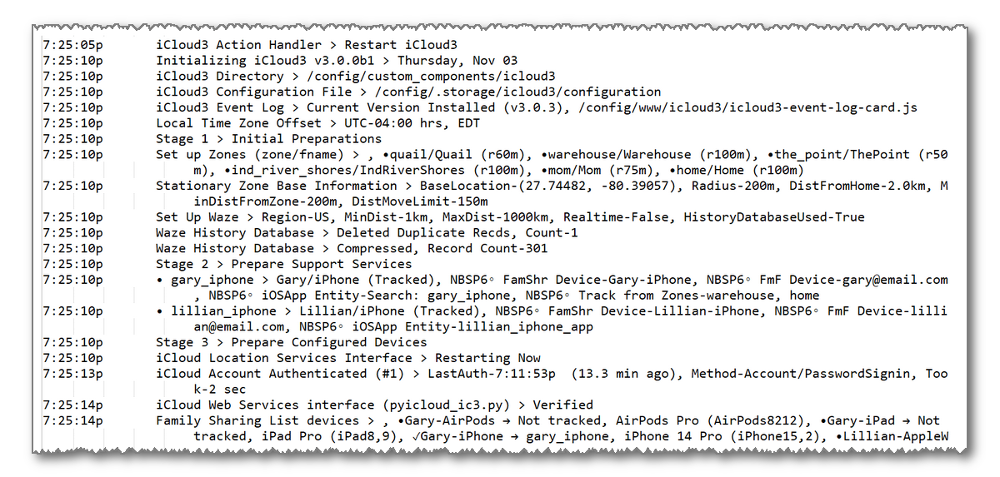
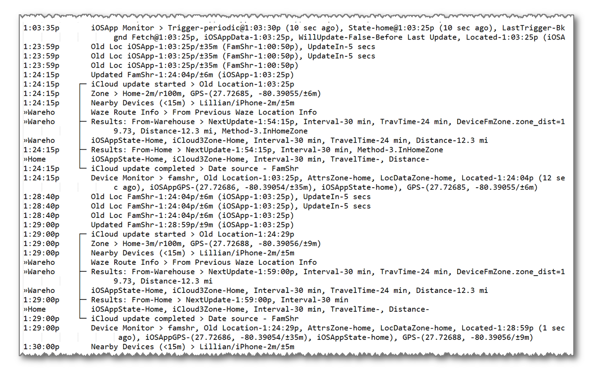

# Other Features


------

### Tracking From More Than One Zone

Normally, you track a device from the Home Zone. The sensor entities for travel time, distance, intervals, next update time, etc. are calculated for the Home Zone. iCloud3 also lets you track a device from another zone. It will calculate the same type of sensor entities for that zone. 

To track from another zone, select that zone in the *Track from Zones* parameter on the *Update Tracked iCloud3 Device* screen. 

1. Select the *iCloud3 Devices* screen.
2. Select the device to be tracked from the other zone.
3. Select the *Track-from-Zones* field, then select the zones to be tracked from.


New sensors are created for all of the track-from-zones.

- **Sensor Entities** - The zone name is added to the end of the entity name.
  - Home Zone -*sensor.gary_iphone_travel_time_home, sensor.gary_iphone_zone_distance_home*, etc.
  - Warehouse Zone - *sensor.gary_iphone_travel_time_warehouse, sensor.gary_iphone_zone_distance_warehouse*, etc.

- **Sensor's Friendly Name** - The zone's display-as friendly is added to the end of the sensor friendly name:
  - Home Zone - Gary TravelTime (Home), Gary ZoneDistance (Home), etc.
  - Warehouse Zone - Gary TravelTime (Warehouse), Gary ZoneDistance (Warehouse), etc.

The Track-from-Zone sensors mentioned above are optional, only the sensors that will be displayed on a Lovelace card or used in an automation need to be created.  They are selected on *iCloud3 Configurator > Sensors* screen.


The sensors created when only tracking from the Home zone (*sensor.gary_iphone_travel_time, sensor.gary_iphone_zone_distance, etc.*) have changed:

- Closer to the Home zone - Show the Home zone information
- Within 8km of the Other zone and going towards it - Show the Other zone's information
- Within 8km of the Other zone and going away from it - Show the Home zone's information
- Going towards both zones - Show the Home zone's information if more than 8km away from the Other zone
- Other zone's information is displayed - It's first initial is displayed in the *distance* sensor (🅦 is shown for the Warehouse zone).


------

### Display the Waze History Locations on a Map Card

Use the *sensor.icloud3_wazehist_track* sensor entity as the source of a Lovelace map card to see the locations of all of the 11m locations points that have been saved. 

Create a Lovelace map card:


Or copy the yaml code below into the *Show Code Editor* yaml code field on a new Lovelace card.

```type:yaml
type: map
entities:
  - entity: sensor.icloud3_wazehist_track
hours_to_show: 24
```

After the location data has been loaded into the sensor, the resulting map card looks similar to the map below. 


> This really does not have any practical use but it was a fun project to see how many locations had been saved.

Each of the dots on the map is a saved location. Unfortunately, Home Assistant treats the locations on the map card as a tracking point and draws a line between the points in the order they were loaded. Ignore the lines.

To try to display the points in a logical order based on your most frequent driving direction, select *North-South* or *East-West* in the *Waze Location Map Display* field on the *Waze - History Database* parameter screen.


### How to Remove the Lines Between the Locations  {docsify-ignore}

The lines between the locations dots can be removed using the *card-mod* Lovelace custom style developed by Thomas Loven. With *card-mod*, custom CSS styles can be applied to various elements of the Home Assistant frontend (element colors, icons, borders, etc.). Information about *card_mod* can be found [here](https://github.com/thomasloven/lovelace-card-mod/blob/master/README.md).

> Using this custom style, the North-South and East-West track direction is irreverent since the lines between the locations is not displayed.

The installation is described in the *card-mod* documentation and below.

1. Install *card_mod* with Hacs. (Hacs > Frontend > Search for *card-mod* > Lovelace > Download)

2. Add the following to your `configuration.yaml` file and restart Home Assistant.

   ```
   frontend:
     extra_module_url:
       /hacsfiles/lovelace-card-mod/card-mod.js
   ```

   Change the path if you have moved the *card-mod.js* file to another location. If you installed through HACS, it is probably `/hacsfiles/lovelace-card-mod/card-mod.js`.

3. Edit the Lovelace map card configuration parameters described above.

   ```type:yaml
   type: map
   entities:
     - entity: sensor.icloud3_wazehist_track
   hours_to_show: 24
   card_mod:
     style:
       ha-map$:
         .leaflet-pane: |
           path {
             fill: red;
             stroke: none;
           }
         .leaflet-overlay-pane: |
           path {
             fill: red;
             stroke: none;
           }
   ```


After the location data has been loaded into the sensor, the map card now looks like this.


### Loading the saved locations  {docsify-ignore}

The saved locations are loaded into the *sensor.icloud3_wazehist_track* sensor entity several ways.

- Each night at midnight.
- Immediately by selecting *Event Log > Actions > WazeHist - Load track locations for map*
- Immediately by selecting *iCloud3 Configurator > Actions > Waze Hist Map Track - Load route locations for map display*


-----

### Device Tracker Services

Three services are available for the iCloud3 device tracker component that can be used in automations.  These are also requested using *Event Log > Actions*.

| Service           | Description                                                  |
| ----------------- | ------------------------------------------------------------ |
| action           | Send commands to iCloud3 that change the way it is running (pause, resume, restart, etc.) |
| find_iphone_alert | Display the *Find My iPhone Alert* notification and play an alert sound on the specified phone. |
| restart           | Restart iCloud3.                                             |


#### *icloud3.action* Service

This service allows you to change the way iCloud3 operates. The following parameters are used:

| Parameter | Description |
|-----------|-------------|
| device_name | Name of the device to be updated. All devices will be updated if this parameter is not specified.  All instances of the device_name are updated if it is in several groups. update *(Optional)* |
| command/parameter | The action to be performed (see below). *(Required)* |


The following describe the commands that are available. 

| Command/Parameter |  Description |
|-----------------|-------------|
| pause |  Stop updating/locating a device (or all devices). Note: You may want to pause location updates for a device if you are a long way from home or out of the country and it doesn't make sense to continue locating your device. |
| resume |  Start updating/locating a device (or all devices) after it has been paused. |
| restart | Restart the iCloud3 custom component. |
| locate interval | Locate the device or all devices based on the following *locate interval* parameters:<br><br>`- no interval parameter` - Locate the device using the iCloud Location Services immediately<br>`- iosapp` - Send a location request to the iOS App associated with the device.<br>`- interval time` - Set the *Next Location Time* to the *current time + the interval time*<br><br>Examples:<br>`- locate`<br>`- locate iosapp`<br>`- locate 30 secs`<br>`- locate 15 mins`<br>`- locate 2 hrs` |

#### Example Automations or Scripts  {docsify-ignore}

```yaml
# Commands that control how iCloud3 operates

icloud3_command_restart:
  alias: 'Restart iCloud (Command)'
  sequence:
    - service: icloud3.action
      data:
        command: restart
       
icloud3_command_resume_polling:
  alias: 'Resume Polling'
  sequence:
    - service: icloud3.action
      data:
        command: resume
        
icloud3_command_pause_polling:
  alias: 'Pause Polling'
  sequence:
    - service: icloud3.action
      data:
        command: pause

icloud3_command_pause_polling_gary:
  alias: 'Pause (Gary)'
  sequence:
    - service: icloud3.action
      data:
        device_name: gary_iphone
        command: pause
```

```yaml
# Commands to Locate devices:

icloud3_command_locate_gary_iosapp:
  alias: 'iCloud3 Locate (Gary) - iOS APP'
  sequence:
    - service: icloud3.action
      data:
        device_name: gary_iphone
        command: locate iosapp      

icloud3_command_locate_gary_immediately:
  alias: 'iCloud3 Locate (Gary) - Immediately'
  sequence:
    - service: icloud3.action
      data:
        device_name: gary_iphone
        command: locate

icloud3_command_locate_all_immediately:
  alias: 'iCloud3 Locate (All) - Immediately'
  sequence:
    - service: icloud3.action
      data:
        command: locate

icloud3_command_locate_all_15_secs:
  alias: 'iCloud3 Locate (All) - 15-secs'
  sequence:
    - service: icloud3.action
      data:
        command: locate 15 secs
        
icloud3_command_locate_gary_30_mins:
  alias: 'iCloud3 Locate (Gary) - 30-mins'
  sequence:
    - service: icloud3.action
      data:
        device_name: gary_iphone
        command: locate 30 mins
        
```


#### *icloud3.find_iphone_alert* Service

This service will display a notification and play on the specified device based on the tracking method:

- Family Sharing - Display the alert using the Find My iPhone Alert process build into iOS.
- Find-my-Friends, iOS App - Send a notification with sound to the iOS App on the specified device .

| Parameter | Description |
|-----------|-------------|
| device_name | Name of the device *(Required)* |

``` yaml
#Send the Find My iPhone Alert message

icloud3_find_phone_alert_gary:
  alias: 'Find iPhone Alert (Gary)'
  sequence:
    - service: icloud3.find_iphone_alert
      data:
        device_name: gary_iphone

    - service: script.notify_gary_iphone
      data_template:
        title: 'Find iPhone Alert'
        message: 'Find iPhone Alert was triggered for Gary (gary_iphone)'
```
#### *icloud3.lost_device_alert* Service

This service will sendy a notification to the specified device that the device has been lost and to call the phone number in the message.:

- Family Sharing - Display the alert using the Find My iPhone Alert process build into iOS.
- Find-my-Friends, iOS App - Send a notification with sound to the iOS App on the specified device .

| Parameter | Description |
|-----------|-------------|
| device_name | Name of the device *(Required)* |
| number | Phone number to call *(Required)* |
| message | A message that will be displayed on the locked screen *(Required)* |

``` yaml
#Send the Lost Device Alert message

icloud3_lost_device_alert_gary:
  alias: 'Lost Device Alert (Gary)'
  sequence:
    - service: icloud3.lost_device_alert
      data:
        device_name: gary_iphone
        number: '123-456-7890'
        message: 'This Phone has been lost. Please call this number to report it found.'

    - service: script.notify_gary_iphone
      data_template:
        title: 'Lost Device Alert'
        message: 'The Lost Device Alert message has been sent to Gary (gary_iphone)'
```


#### *icloud3.restart* Service

This service will restart iCloud3 and refresh all of the devices being handled by iCloud3. It does the same action as the `icloud3_command` with the `restart` option described above. You will have to restart Home Assist if you have made changes to the configuration parameters (new device type, new device name, etc.) 

```yaml
#Commands to Restart iCloud3

icloud3_command_restart:
  alias: 'iCloud3 Restart'
  sequence:
    - service: icloud3.restart
```


-----

### Export Event Log

The Event Log is exported to the file */config/icloud3-event-log_[date]_[time].txt* file using the following methods:

- Select *Export Event Log* from the *Event Log > Actions* drop down menu.
- Select *Export Event Log* from the *Configurator > Actions* menu.

The sections on the report are:

- Device configuration parameters
- General configuration parameters
- Start up results
- Device location and tracking results





