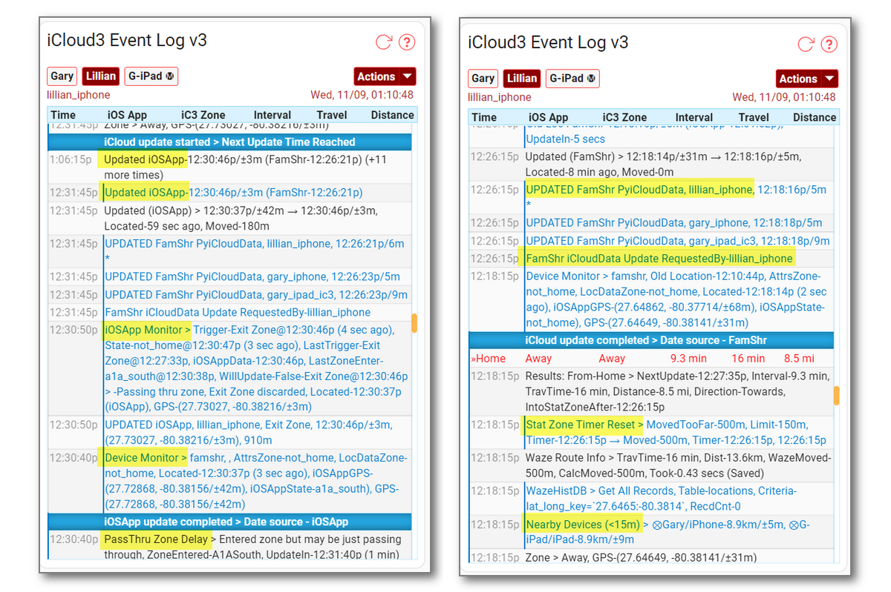
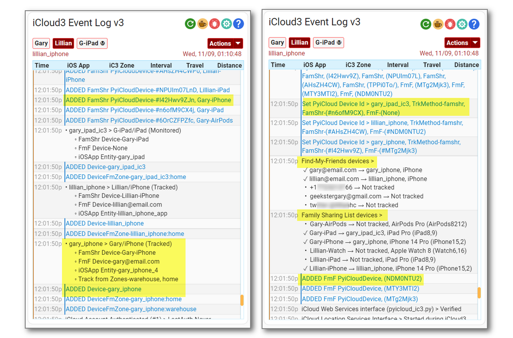
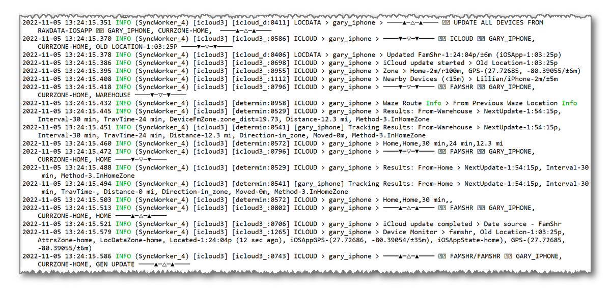

# Trouble Shooting Problems


-----

### The Event Log shows the following message but I can not find the 'platform: icloud3' parameter

```
iCloud3 is an Integration. Delete the 'platform: icloud3'
configuration parameters in the HA 'configuration.yaml' file.
```


-----

### The phone does not go to an Away state when you exit a zone

Not changing to Away when you leave a zone means iCloud3 is not getting the zone exit trigger from the iOS app. Check the following:

1. Verify the iOS App device_tracker entity name has not changed. 

   - Go to *Configuration > iCloud3 Devices > Select device> iOS App device_tracker entity* and verify the tracked device has a valid iOS App device_tracker entity assigned.

2. The HA mobile app integration is not installed. 

   - Go to *Installing and Configuring iCloud3 > Step #2 - Install the iOS App on your iPhone or iPad* for more information.

3. The iOS app device_tracker entity location is not being updated by the iOS app. 

   - The iOS App logs events as they take place, including location changes and zone enter/exit activity. On the device, open the iOS App. Select *HA Settings > Companion App > Debugging*. Then select *Event Log* to see what events the iOS App responded to or *Location History* to display a map showing the devices location at various times.

   - Check the device_tracker state value to see if is being updated. Go to *Developer Tools > States > device_tracker entity* and see if the zone name is displayed. The value is *not_home* when you are not in a zone and the zone's name when you are in a zone.

   - Verify the iOS App is sharing location information. Go to *Installing and Configuring iCloud3 > Step #2 - Install the iOS App on your iPhone or iPad* for screenshots of the correct settings.

   - Tracking Monitors can be displayed in the Event Log that show update activity. Select *Event Log > Actions > Show/Hide Tracking Monitors*. Look at the state change and trigger change values and times they changed. See *Debugging with Tracking Monitors* below.


-----

### Not all of the devices are being tracked

iCloud3 uses the location data from your iCloud account to track and locate your devices. If iCloud3 reports the location of some devices correctly but does not locate others, the devices not tracked are probably not set up correctly.

Check the following on the untracked devices:
- **Settings App > Privacy & Security**:
  - **Locations Services** is On
  - **Share My Location >**
    - *Find My iPhone* is On
    - *Share My Location* is On
    - *Family* > This shows the Family members this device can see in the FindMy app. Make sure all the people you are tracking with iCloud3 are listed. This does not list each device for the Family member, just the person.
    - *Friends* > This shows the Friends you have sent an invitation to and requested that they share their location. They can be tracked using the Find-my-Friends tracking method.

- **FindMy App**:
  - **People** > This should show all the people sharing their location. All the people having devices tracked with iCloud3 should be listed here.
  - **Devices** > This shows every device that is being located and tracked. If the device is not listed here, it can not be tracked by iCloud3. 
    - One device is the owner of the iCloud Account. It must be able see all of the devices you want to track on this parameter and on the map. If a device is not shown, iCloud3 will not be able to track it.

It is helpful to have a device that tracks correctly. Compare it's settings with the one that is not being tracked.


-----

### Debugging with Tracking Monitors

Tracking monitors can be displayed to identify errors and help answer questions related to device availability, poor location data errors, how the tracking results are calculated, etc. The messages are displayed in blue to help identify and highlight them.

- Select *Event Log > Actions > Show/Hide Tracking Monitors* command. 


Below are sample Tracking Monitors screens.


			*Event Log Tracking Monitors during start up*


		*Event Log Tracking Monitors while away from Home*


		*Event Log Tracking Monitors while away from Home


-----

### Debugging with Log Level

The *Log Level* on the *Event Log > Actions* drop down list and on the *Configurator > Other Parameters* screen specify the type of logging records to add to the Home Assistant log file (*home-assistant.log*). They are:

**Info** - Normal operations, add few records for the results of a location request.


**Debug** - Add more detailed records related to location requests, how the data is processed and the results.



**RawData** - Add records for setting up iCloud3 (device_tracker and sensor entities, zones, devices, etc.), the iOS App data used to handle location update and triggers and the data requested from and received from iCloud Location Servers.


