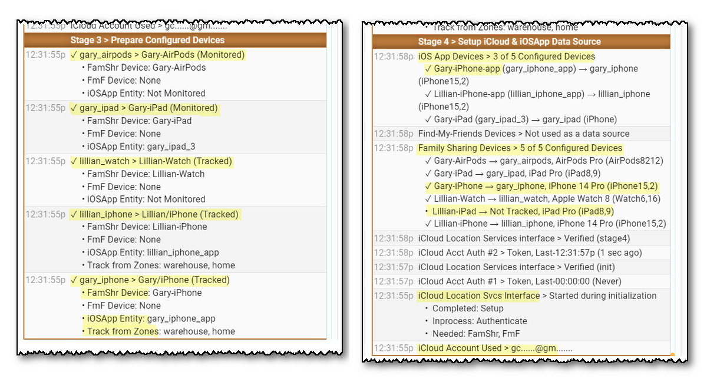
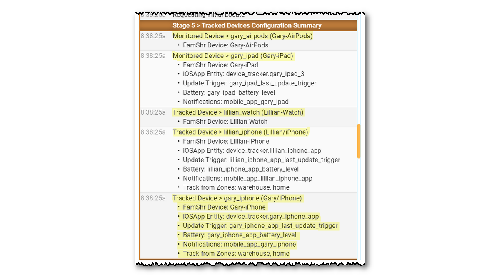
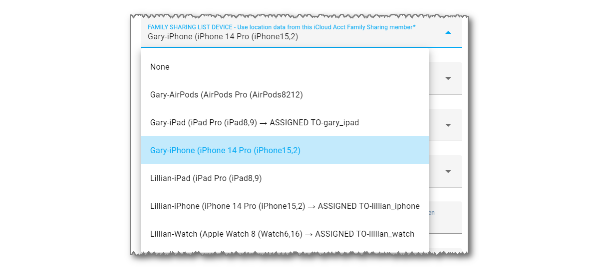
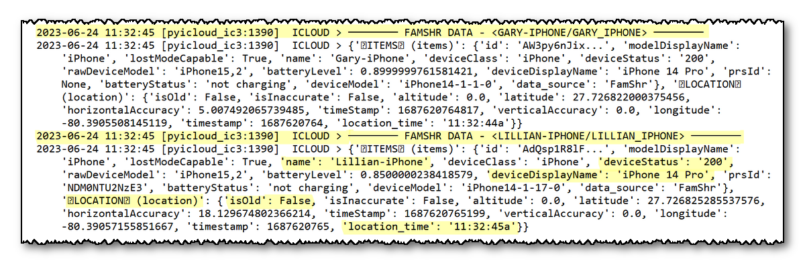

# Device Tracking Problems

The following questions are discussed below:

- The Event Log shows the following message but I can not find the 'platform: icloud3' parameter
- The phone does not go to an Away state when you exit a zone
-  Not all of the devices are being tracked


-----

### The Event Log shows the following message but I can not find the 'platform: icloud3' parameter

```
iCloud3 is an Integration. Delete the 'platform: icloud3'
configuration parameters in the HA 'configuration.yaml' file.
```

You can delete (or comment out) the iCloud3 parameters in the *configuration.yaml* file. Once iCloud3 is configured and you are satisfied, delete the parameters from the *configuration.yaml* file and delete the *config-ic2.yaml* file.

If you can not find the parameters or the *config-ic3.yaml* file, keep looking. Be sure to check any sub-directories you might be using with an *include* statement.


-----

### The phone does not go to an Away state when you exit a zone

Not changing to Away when you leave a zone means iCloud3 is not getting the zone exit trigger from the iOS app. Check the following:

1. Verify the iOS App device_tracker entity name has not changed. 
   - Go to *Configuration > iCloud3 Devices > Select device> iOS App device_tracker entity* and verify the tracked device has a valid iOS App device_tracker entity assigned.
2. The HA mobile app integration is not installed. 
   - Go to *Installing and Configuring iCloud3 > Step #2 - Install the iOS App on your iPhone or iPad* for more information.
3. The iOS app device_tracker entity location is not being updated by the iOS app. 
   - The iOS App logs events as they take place, including location changes and zone enter/exit activity. On the device, open the iOS App. Select *HA Settings > Companion App > Debugging*. Then select *Event Log* to see what events the iOS App responded to or *Location History* to display a map showing the devices location at various times.
   - Check the device_tracker state value to see if is being updated. Go to *Developer Tools > States > device_tracker entity* and see if the zone name is displayed. The value is *not_home* when you are not in a zone and the zone's name when you are in a zone.
   - Verify the iOS App is sharing location information. Go to *Installing and Configuring iCloud3 > Step #2 - Install the iOS App on your iPhone or iPad* for screenshots of the correct settings.
   - Tracking Monitors can be displayed in the Event Log that show update activity. Select *Event Log > Actions > Show/Hide Tracking Monitors*. Look at the state change and trigger change values and times they changed. See *Debugging with Tracking Monitors* below.


-----

### Not all of the devices are being tracked

iCloud3 uses the location data from your iCloud account to track and locate your devices. If iCloud3 reports the location of some devices correctly but does not locate others, the devices not tracked are probably not set up correctly.

Check the following on the untracked devices:

#### Settings App > Privacy & Security

- **Locations Services** is On
- **Share My Location >**
  - *Find My iPhone* is On
  - *Share My Location* is On
  - *Family* > This shows the Family members this device can see in the FindMy app. Make sure all the people you are tracking with iCloud3 are listed. This does not list each device for the Family member, just the person.
  - *Friends* > This shows the Friends you have sent an invitation to and requested that they share their location. They can be tracked using the Find-my-Friends tracking method.

#### FindMy App

- **People** > This should show all the people sharing their location. All the people having devices tracked with iCloud3 should be listed here.
- **Devices** > This shows every device that is being located and tracked. If the device is not listed here, it can not be tracked by iCloud3. 
  - One device is the owner of the iCloud Account. It must be able see all of the devices you want to track on this parameter and on the map. If a device is not shown, iCloud3 will not be able to track it.
  - If you have a device that tracks correctly, compare it's settings with the one that is not being tracked.
- **Things to look for:**
  - Make sure there is not more than one than one device for the same person. For example, when you upgrade your phone, the old one is not removed from the Family Sharing account, the new one will be added with the same name as the old one with a suffix *(2)*. iCloud3 will continue to track the old device (which does not exist), not the new one.
  - 
  - Make sure the device is located and the location time is current. It is constantly shows *locating*, Apple is having trouble communicating with it to get it's location. If Apple can not locate it, neither can iCloud3

#### Event Log

- **Stage 3 > Prepare Configured Device**s - This stage shows each device that will be tracked and the parameters in the configuration.
- **Stage 4 > Setup iCloud & iOSApp Tracking Methods, Family Sharing List devices** - This stage lists all of the devices in the Family Sharing List on your iCloud account. 
  - A *check mark* indicates the device is being tracked by iCloud3. 
  - A *No Location* message indicates iCloud did not return any location information. iCloud3 will do several retries to clear this up before displaying an error message.
  - A *Not Tracked* message indicates this device is not in the iCloud3 configuration.

    
- **Things to look for:**

  -  Stage 4 - Every device in the Family Sharing list is listed. This includes the current iPhones, iPads, etc. along with old devices you no longer have.
  - Stage 4 - Make sure there are no duplicate devices names for different models (for example: Gary-iPhone/iPhone 12, Gary-iPhone (2)/iPhone 13 Pro, etc). If there is, delete the old device from the Family Sharing List, change the name on the device itself (Settings > General > About) and select the correct device in the iCloud3 Configuration Wizard.
  - Stage 3 - Make sure the device assigned in the configuration is correct and not  duplicate or old device that you no longer own.
- **Stage 5 > Configure Tracked Devices** - This screen is a summary of how the device is set up. 

  - It shows the monitored and tracked devices
  - The actual entities or devices that have been assigned:
    - FamShr Device - The device from the family Sharing List
    - iOS App Entity device - the HA device_tracker entity name
    - Update Trigger - The iOS App's update trigger sensor that is monitored
    - Battery - The iOS App's Battery sensor entity that is monitored for the battery level
    - Notifications - Where messages will be sent using the iOS App
    - Track from Zones -  The zones that are tracked from when tracking from more than one zone




​    

#### iCloud3 Configuration Wizard

- **Update Device screen** - Check the *Update Device* screen for the device that is not being tracked. Verify the Family Sharing device is set to the correct one. If you upgraded your phone and did not delete the old phone and did not rename the new one to the old phone's name, iCloud3 may still be tracking the old one. Look at the devices model number to make sure the assignment is correct.

  Remember, the device might still be tracked with the iOS App but getting Location Old errors from iCloud.

  

#### Log Level > RawData

- If nothing works, you can turn on raw data logging and see the actual data iCloud3 receives from iCloud Web/Location Servers. This, and other records show when iCloud3 requests location data and what is sent back. When one device makes a request, the information for all devices in the Family Sharing account is returned. 

  The raw data is written to the **/config/icloud3-0.log* file.

- **Turn on RawData logging**:

  - Configuration Wizard > Menu Page 2 > Format Settings - Select Log Level > RawData

    -- or --

  - Event Log > Actions > Start RawData Logging

- The following snippet if for *Gary-iPhone/gary_iphone* and *Lillian-iPhone.lillian_iphone*. Look at:

  - name - The name of the device from Settings > General > About. It should be the device name selected in the iCloud3 configuration and listed on the iCloud3 Startup Stage 3, 4 and 5.

  - deviceStatus - Indicates if the device is online and available (200), it it is offline (201) or pending/waiting for a response (202).

  - isOld - Indicates the device location is old and Apple is having trouble contacting it for it's location.

    location_time - The last time that Apple was able to communicate with the device and get it's location.

  

- **Things to look for:**

  - Make sure the device not being tracked is listed.
  - Scroll through the *icloud3-0.log* file and look for each time the non-tracked device appears. Look at the location_time and see if it is old and if it changes.

